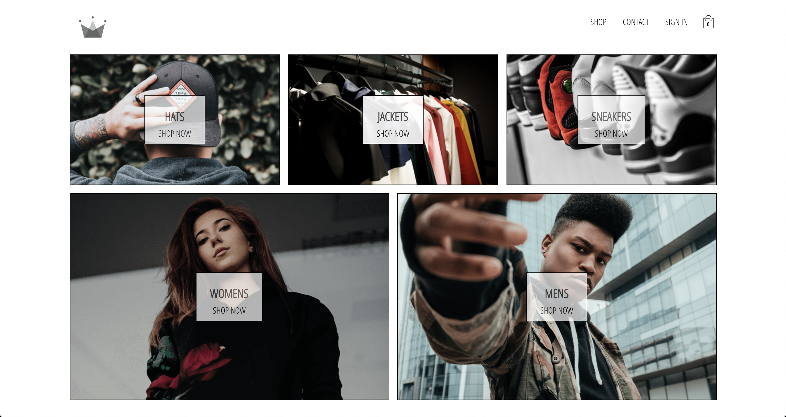

# Crown clothing

Crown clothing is a react.js e-commerce website that allows you to purchase clothing on the web.

</img>


## Installation

Use the package manager [npm](https://docs.npmjs.com/) to install needed dependencies.

```bash
npm install
```


## Technologies used:

- Firebase (for auth and database)
- React.js
- JavaScript
- Stripe (for payment)


## Launching Crown cloithing

run 

```bash
npm start
```


## Contributing
Pull requests are welcome. For major changes, please open an issue first to discuss what you would like to change.

Please make sure to update tests as appropriate.

## License
[MIT](https://choosealicense.com/licenses/mit/)